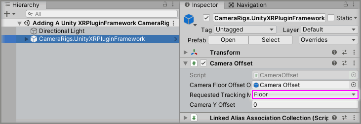
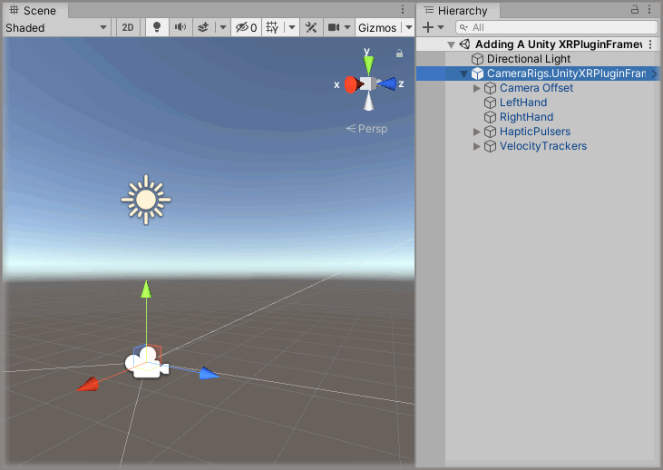

# Adding A Unity XRPluginFramework CameraRig

> * Level: Beginner
>
> * Reading Time: 2 minutes
>
> * Checked with: Unity 2019.3.0f6

## Introduction

The `CameraRigs.UnityXRPluginFramework` prefab provides a camera that tracks the HMD rotation and position along with any available XR controllers. This utilizes the [XR Plugin Framework] package for the [Unity] software.

## Prerequisites

* [Install the Tilia.CameraRigs.XRPluginFramework.Unity] package dependency in to your Unity project.

## Let's Start

### Step 1

Add a `CameraRigs.UnityXRPluginFramework` prefab to the Unity project hierarchy by selecting `GameObject -> Tilia -> Prefabs -> CameraRigs -> CameraRigs.UnityXRPluginFramework` from the Unity main top menu.

### Step 2

Delete the `Main Camera` GameObject from the Unity Hierarchy window as the `CameraRigs.UnityXRPluginFramework` prefab contains a Main Camera for the Scene.

### Step 3

Select the `CameraRigs.UnityXRPluginFramework` GameObject in the Unity Hierarchy window and change the `Camera Offset` component to suit your Tracking Space requirements.

* Ensure the `Requested Tracking Mode` is set to:
  * `Floor` for XR devices that support 6 degrees of freedom tracking (the ability to move around your play area).
  * `Device` for XR devices that support 3 degrees of freedom tracking (only the ability to look around but not move within your play area).

### Done

Now you have a Unity XRPluginFramework CameraRig in your scene. If you play the Unity scene you will see that the game Main Camera is tracking the XR HMD and if there is a connected left and/or right XR controller then they will be tracking the Left/Right Anchors of the UnityXR CameraRig.

[Install the Tilia.CameraRigs.XRPluginFramework.Unity]: ../Installation/README.md
[Unity]: https://unity3d.com/
[XR Plugin Framework]: https://docs.unity3d.com/2019.3/Documentation/Manual/XR.html