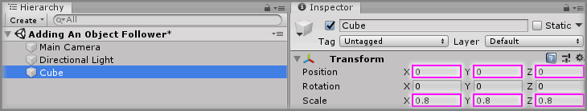
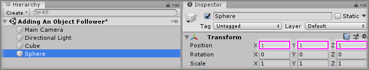
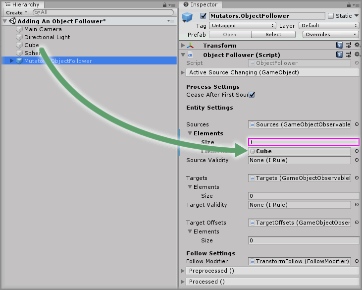
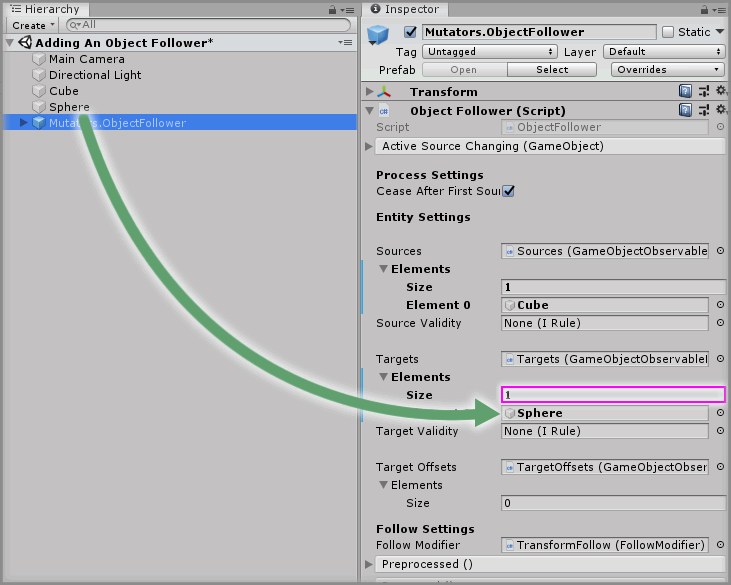
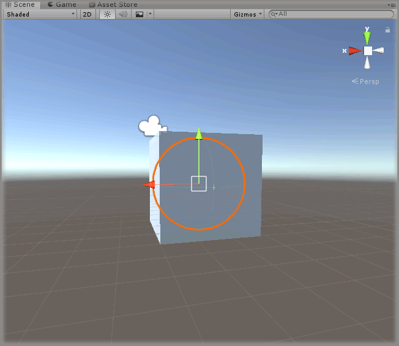
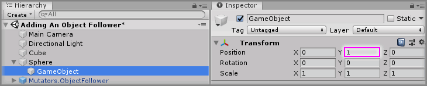
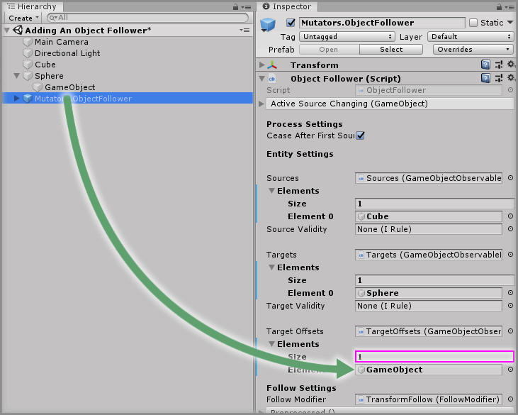
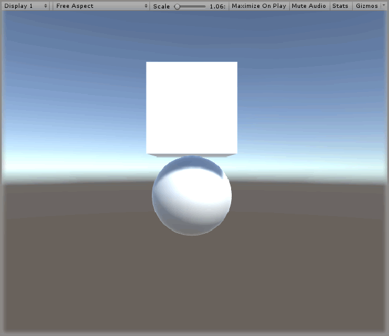

# Adding An Object Follower

> * Level: Beginner
>
> * Reading Time: 5 minutes
>
> * Checked with: Unity 2018.3.14f1

## Introduction

The purpose of the Object Follower prefabs is the to have one or more GameObjects follow another GameObject around the [Unity] scene without the need to nest the GameObjects underneath each other.

There are two types of follow:

* `Mutators.ObjectFollower` - Updates the `Transform` data of the target to match the `Transform` data of the source.
* `Mutators.RigidbodyFollower` - Updates the target by applying velocities to the target `Rigidbody` until the target `Transform` data matches the source `Transform` data.

## Prerequisites

* [Install the Tilia.Mutators.ObjectFollower.Unity] package dependency in to your Unity project.

## Let's Start

### Step 1

Create a new `Cube` Unity 3D Object by selecting `Main Menu -> GameObject -> 3D Object -> Cube` and change the `Transform` properties to:

* Position: `X = 0`, `Y = 0`, `Z = 0`
* Scale: `X = 0.8`, `Y = 0.8`, `Z = 0.8`

This will be used as the source GameObject to follow around the Unity scene.

### Step 2

Create a new `Sphere` Unity 3D Object by selecting `Main Menu -> GameObject -> 3D Object -> Sphere` and change the `Transform` properties to:

* Position: `X = 1`, `Y = 1`, `Z = 1`

This will be used as the target GameObject that will follow the source GameObject around the Unity scene.

### Step 3

Add a `Mutators.ObjectFollower` prefab to the Unity project hierarchy by selecting `GameObject -> Tilia -> Prefabs -> Mutators -> Mutators.ObjectFollower` from the Unity main top menu.

### Step 4

Select the `Mutators.ObjectFollower` GameObject in the Unity Hierarchy window then increase the `Sources -> Elements -> Size` property by `1` on the `Object Follower` component.

> The size property will be `0` by default so change it to `1`.

Drag and drop the `Cube` GameObject into the newly displayed `Element 0` property value within the `Sources` property on the `Object Follower` component.

### Step 5

Increase the `Targets -> Elements -> Size` property by `1` on the `Object Follower` component.

> The size property will be `0` by default so change it to `1`.

Drag and drop the `Sphere` GameObject into the newly displayed `Element 0` property value within the `Targets` property on the `Object Follower` component.

Play the Unity scene and notice how the Sphere snaps to the same world position as the Cube. If you move the Cube around the Unity scene then the Sphere will follow it exactly and in real time.

### Step 6

We are now going to create an offset so when the Sphere follows the Cube, it is a slight distance away from the position of the Cube.

Create an empty GameObject as a child of the Sphere and change the `Transform` properties to:

* Position: `X = 0`, `Y = 1`, `Z = 0`

### Step 7

Select the `Mutators.ObjectFollower` GameObject in the Unity Hierarchy window then increase the `Target Offsets -> Elements -> Size` property by `1` on the `Object Follower` component.

> The size property will be `0` by default so change it to `1`.

Drag and drop the `Sphere -> GameObject` empty GameObject into the newly displayed `Element 0` property value within the `Target Offsets` property on the `Object Follower` component.

### Done

Play the Unity scene and notice now has the Sphere still follows the Cube around the Unity scene, however the Sphere is offset underneath the Cube.

[Unity]: https://unity3d.com/
[Install the Tilia.Mutators.ObjectFollower.Unity]: ../Installation/README.md